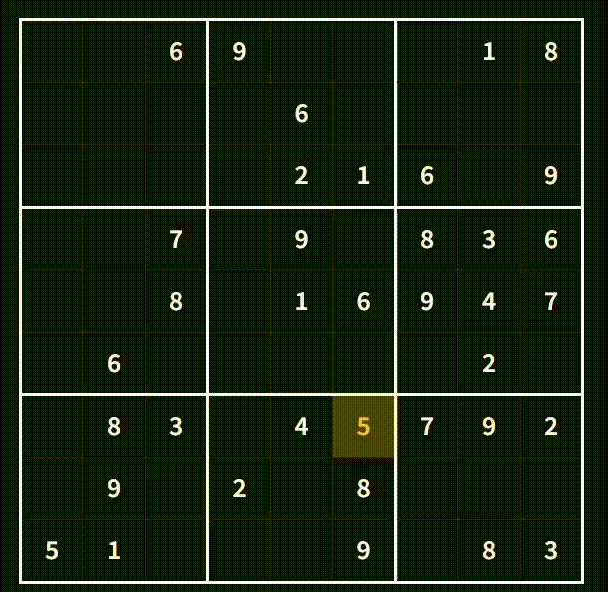

# 🧩 CNN Destekli Hibrit Sudoku Çözücü
<p align="center">
  
</p>
Bu proje; derin öğrenme ile katı mantıksal kuralları birleştiren, yüksek performanslı hibrit bir Sudoku çözücüdür. Geleneksel arama algoritmaları karmaşık bulmacalarda arama uzayı patlamasıyla (search space explosion) karşılaşırken, saf yapay zeka modelleri temel oyun kurallarını ihlal edebilir. Bu proje, hamle tahmini için Evrişimli Sinir Ağlarını (CNN) ve kesin doğruluk garantisi için Top-K Güvenilirlik Backtracking (Geri İzleme) algoritmasını bir araya getirerek bu ikilemi çözer.

---

## 🚀 Öne Çıkan Özellikler

* **Gelişmiş Veri Boru Hattı ve One-Hot Encoding:** Tahta durumlarını kategorik çok kanallı tensörlere (`9x9x10`) dönüştürerek sayısal yanlılığı ortadan kaldırır (modelin 8 sayısını 4'ten "matematiksel olarak büyük" sanmasını engeller).
* **Derin Öğrenme Mimarisi (CNN):** Satırlar, sütunlar ve 3x3'lük alt ızgaralar arasındaki küresel tahta geometrisini yakalamak için uzaysal dolgu (`same`) ve toplu normalleştirme (`batch normalization`) içeren çok katmanlı `Conv2D` katmanları kullanır.
* **Top-K Sezgisel Backtracking:** Körlemesine tahmin yapmak veya rastgele aramak yerine, çözücü CNN'in olasılık dağılımını sorgular, aday hamleleri güven skoruna göre sıralar ve çıkmaz sokaklarda zarifçe geri izleme yapar.
* **%100 Otomatik Test Başarısı:** Standart ve ekstrem veri setlerinde sıfır hatayla titizlikle test edilmiştir.
* **Etkileşimli Web Arayüzü:** Gerçek zamanlı görselleştirme için **Streamlit** ile geliştirilmiş, tam duyarlı (responsive) modern bir karanlık mod (dark-mode) arayüzü içerir.

---

## 🏗️ Proje Mimarisi
```text
SudokuML/
│
├── data/
│   ├── generate_dataset.py    # 25.000 sentetik Sudoku bulmacası ve çözümü üretir
│   └── sudoku_ml_dataset.npz  # Sıkıştırılmış NumPy veri seti (Eğitim/Test ayrımı)
│
├── model/
│   ├── train.py               # CNN mimari tanımı ve eğitim döngüsü
│   └── sudoku_ml_model.keras  # Eğitilmiş Keras model ağırlıkları
│
├── solver/
│   ├── ml_solver.py           # Detaylı adım günlükleriyle tekli bulmaca çalıştırıcı
│   ├── test_solver.py         # Otomatik toplu test paketi (100 bulmaca + performans ölçümü)
│   └── extreme_test.py        # Dünyaca ünlü ekstrem bulmacalara karşı stres testi (AI Escargot)
│
├── app.py                     # Etkileşimli Streamlit web uygulaması
└── requirements.txt           # Proje bağımlılıkları
```
---

## 🛠️ Kullanılan Teknolojiler ve Kütüphaneler
* **Python**
* **TensorFlow / Keras** (Derin öğrenme ve CNN model eğitimi)
* **NumPy** (Tensör manipülasyonları ve veri seti yapılandırması)
* **Streamlit** (İnteraktif web arayüzü framework'ü)

---

## ⚙️ Kurulum ve Çalıştırma

1. **Repoyu klonlayın:**
   ```bash
   git clone https://github.com/ikbaltorun/SudokuML.git
   cd SudokuML
   ```
2. **Bağımlılıkları yükleyin:**
   ```bash
   pip install -r requirements.txt
   ```
3. **İnteraktif web uygulamasını çalıştırın:**
   ```bash
   streamlit run app.py
   ```
4. **Otomatik kıyaslama ve test paketini çalıştırın (100 Bulmaca):**
   ```bash
   cd solver
   python test_solver.py
   ```
5. **Ekstrem stres testini çalıştırın (AI Escargot ve 17-İpuculu Minimal):**
    ```bash
    cd solver
    python extreme_test.py
    ```

---

## 📊 Performans ve Metrikler

* **Ortalama Test Başarısı:** %100.00 (100 rastgele test vakası üzerinden)
* **İşlem Hızı:** Bulmaca başına milisaniye seviyesi (optimize edilmiş tensör işleme mimarisi ile yüksek hızlı çıkarım)
* **Ekstrem Bulmaca Yönetimi:** *AI Escargot* ve *17-Clue* gibi dünya klasmanındaki en zorlu bulmacaları dahi performans darboğazı yaşamadan başarıyla çözer.
